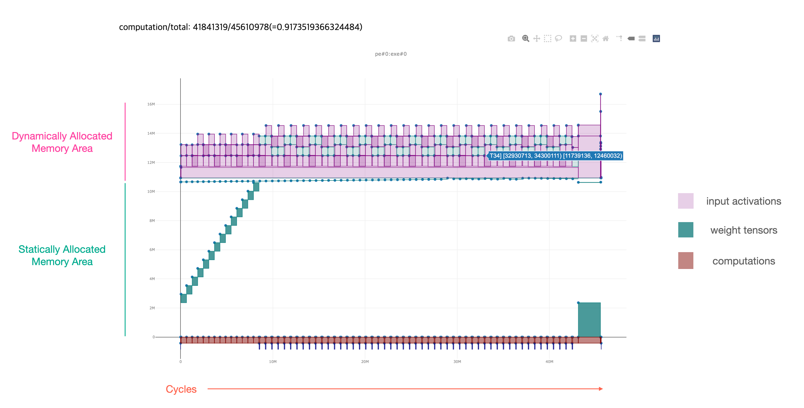

# Furiosa CLI

Currently, Furiosa CLI provides two features:
* Compilation of a Tflite or Onnx model to an executable binary for Furiosa's NPU
* Performance estimation of a model in Furiosa's NPUs

## Installation

Requirements:
 * Python 3.7 or higher
 * pip3

Installing the latest release
```
pip3 install --upgrade git+https://github.com/furiosa-ai/furiosa-cli.git@release-0.1.3
```

Installing the development version
```
pip3 install --upgrade git+https://github.com/furiosa-ai/furiosa-cli.git
```

## How to set API keys
Furiosa CLI requires a pair of API keys to run. If you don't have API keys, please contact Furiosa AI.

There are two ways to set API keys for Furiosa CLI.
### Shell environment variables
You can set two environment variables as follow and then run your program:
```sh
export FURIOSA_ACCESS_KEY_ID=XXXXXXXXXXXXXXXXXXXXXXXXXXXXX
export FURIOSA_SECRET_ACCESS_KEY=YYYYYYYYYYYYYYYYYYYYYYYYYY
``` 

### Credential file
You can also set your API key in `$HOME/.furiosa/credential` as following:
```sh
FURIOSA_ACCESS_KEY_ID=XXXXXXXXXXXXXXXXXXXXXXXXXXXXX
FURIOSA_SECRET_ACCESS_KEY=YYYYYYYYYYYYYYYYYYYYYYYYYY
```

## Command usages
To see more options, please run 'furiosa --help' as follow:
```
furiosa
ERROR: Need command

usage: furiosa [-h] [-q] [-d] [-v]
               {version,compile,perfeye,build_calibration_model,quantize} ...

Furiosa AI Web Service CLI

positional arguments:
  {version,compile,perfeye,build_calibration_model,quantize}
    version             Print out the version
    compile             Compile your model and generate a binary for Furiosa
                        NPU
    perfeye             Generate a visialized view of the static performance
                        estimation
    build_calibration_model
                        build calibration model help
    quantize            quantize help

optional arguments:
  -h, --help            show this help message and exit
  -q, --quiet           Quiet mode, CLI will not print out any message
  -d, --debug           Dnable debug mode
  -v, --verbose         increase output verbosity
```

To see options of each command, please run as follow:
```
furiosa <command> --help
```

## Examples of command lines:
### Compiling tflite models

`compile` command will compile your tflite model and generate an ENF file, 
which is the binary format executable in Furiosa's NPUs.
```sh
$ furiosa compile test_data/MNISTnet_uint8_quant_without_softmax.tflite
output.enf has been generated (elapsed: 513.661 ms)
```

You can specify the output path of the compiled binary.
```sh
$ furiosa compile test_data/MNISTnet_uint8_quant_without_softmax.tflite -o /tmp/mnist.enf 
mnist.enf has been generated (elapsed: 513.661 ms)
```

You can also specify a compiler config. 
```sh
$ furiosa compile test_data/MNISTnet_uint8_quant_without_softmax.tflite --config test_data/compiler_config.yml 
outout.enf has been generated (elapsed: 513.661 ms)
```

### Generating reports from compiler

The compiler also provides the reports to allow users to look into how the compiler works in more details.

*Compiler report*

```
$ furiosa compile test_data/MNISTnet_uint8_quant_without_softmax.tflite -o /tmp/mnist.enf --compiler-report ./compiler-report.txt
```

*Memory allocation report*

```
$ furiosa compile test_data/MNISTnet_uint8_quant_without_softmax.tflite -o /tmp/mnist.enf --mem-alloc-report ./mem-report.html
```

This command will generate './mem-report.html' file which contains the memory allocation graph as the following:



### Estimating a performance of your model

To see the estimated performance, please run `perfeye` command as following with your model image as follow:
```sh
$ furiosa perfeye test_data/MNISTnet_uint8_quant_without_softmax.tflite -o output.html
output.html has been generated (elapsed: 510.783 ms)
```